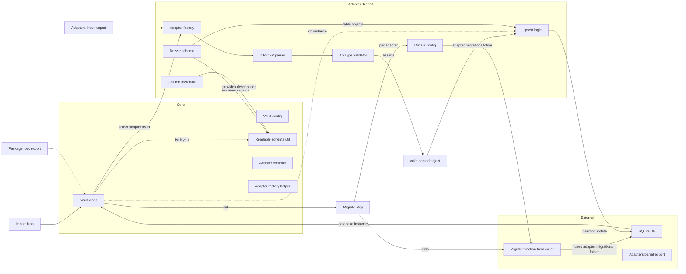

# Vault Core: architecture and adapter relationships

Purpose: explain core functionality, how adapters plug in, and how data flows at runtime. This is a snapshot of the current code to help coworkers review what is exposed and how it connects.

Quick links to top level barrels:

- [src/index.ts](/packages/vault-core/src/index.ts)
- [src/core/index.ts](/packages/vault-core/src/core/index.ts)
- [src/adapters/index.ts](/packages/vault-core/src/adapters/index.ts)

Core surfaces

- Vault container
  - Class: [Vault()](/packages/vault-core/src/core/vault.ts)
  - Init and migrations: [migrate()](/packages/vault-core/src/core/vault.ts)
  - Import flow: [importBlob()](/packages/vault-core/src/core/vault.ts)
  - Current layout exposure: [getCurrentLayout()](/packages/vault-core/src/core/vault.ts)
  - Row counter used in summary: [countRecords()](/packages/vault-core/src/core/vault.ts)
- Vault configuration contract
  - Interface: [VaultConfig()](/packages/vault-core/src/core/config.ts)
  - Caller supplies:
    - Database: any Drizzle SQLite database compatible with adapter schemas; see [CompatibleDB()](/packages/vault-core/src/core/adapter.ts)
    - Platform migrate function: e.g. drizzle-orm migrator for libsql or better; passed to Vault
- Adapter contract and helper
  - Contract: [Adapter()](/packages/vault-core/src/core/adapter.ts)
  - Factory helper: [defineAdapter()](/packages/vault-core/src/core/adapter.ts)
- Schema readability utility
  - Human readable schema and metadata merge: [readableSchemaInfo()](/packages/vault-core/src/core/strip.ts)

Concrete adapter example: Reddit

- Adapter factory: [redditAdapter()](/packages/vault-core/src/adapters/reddit/src/index.ts)
- Drizzle schema tables: [adapters/reddit/src/schema.ts](/packages/vault-core/src/adapters/reddit/src/schema.ts)
- Natural language column metadata: [metadata()](/packages/vault-core/src/adapters/reddit/src/metadata.ts)
- ArkType validation schema: [parseSchema()](/packages/vault-core/src/adapters/reddit/src/validation.ts)
- Parser (ZIP containing CSV files): [parseRedditExport()](/packages/vault-core/src/adapters/reddit/src/parse.ts)
- Upsert logic (transactional onConflictDoUpdate): [upsertRedditData()](/packages/vault-core/src/adapters/reddit/src/upsert.ts)
- Drizzle adapter config and migrations path: [adapters/reddit/src/drizzle.config.ts](/packages/vault-core/src/adapters/reddit/src/drizzle.config.ts)
- Config placeholder type: [adapters/reddit/src/config.ts](/packages/vault-core/src/adapters/reddit/src/config.ts)

Mermaid diagram: components and data flow
Arrow convention: arrows point from source to consumer (adapter-owned schema and metadata flow into core utilities; external DB flows into Vault and then into adapter upsert).

Legend with exact code references

- Core
  - C1 Vault class → [Vault()](/packages/vault-core/src/core/vault.ts)
  - C1M migrate step → [migrate()](/packages/vault-core/src/core/vault.ts)
  - C1U validated parsed object produced inside → [importBlob()](/packages/vault-core/src/core/vault.ts)
  - C2 Vault config → [VaultConfig()](/packages/vault-core/src/core/config.ts)
  - C3 Readable schema util → [readableSchemaInfo()](/packages/vault-core/src/core/strip.ts)
  - C4 Adapter contract → [Adapter()](/packages/vault-core/src/core/adapter.ts)
  - C5 Adapter factory helper → [defineAdapter()](/packages/vault-core/src/core/adapter.ts)
  - X1 Package root export → [src/index.ts](/packages/vault-core/src/index.ts)
- Adapter Reddit
  - A1 Adapter factory → [redditAdapter()](/packages/vault-core/src/adapters/reddit/src/index.ts)
  - A2 Drizzle schema module → [adapters/reddit/src/schema.ts](/packages/vault-core/src/adapters/reddit/src/schema.ts)
  - A3 Column metadata → [metadata()](/packages/vault-core/src/adapters/reddit/src/metadata.ts)
  - A4 ArkType validator → [parseSchema()](/packages/vault-core/src/adapters/reddit/src/validation.ts)
  - A5 ZIP CSV parser → [parseRedditExport()](/packages/vault-core/src/adapters/reddit/src/parse.ts)
  - A6 Upsert logic → [upsertRedditData()](/packages/vault-core/src/adapters/reddit/src/upsert.ts)
  - A7 Drizzle config → [adapters/reddit/src/drizzle.config.ts](/packages/vault-core/src/adapters/reddit/src/drizzle.config.ts)
  - E3 Adapters barrel export → [adapters/index.ts](/packages/vault-core/src/adapters/index.ts)

Runtime relationships in prose

- Ownership and boundaries
  - SQLite DB instance: constructed externally by the caller and injected via [VaultConfig()](/packages/vault-core/src/core/config.ts) database. [Vault()](/packages/vault-core/src/core/vault.ts) stores this instance and passes it into the adapter’s upsert per the [Adapter()](/packages/vault-core/src/core/adapter.ts) contract. Core does not create or own the DB connection.
  - Drizzle schema: defined entirely inside adapters (for example [adapters/reddit/src/schema.ts](/packages/vault-core/src/adapters/reddit/src/schema.ts)). Core never defines tables; it only reads adapter.schema for layout exposure via [readableSchemaInfo()](/packages/vault-core/src/core/strip.ts) and uses adapter.drizzleConfig for migrations during [migrate()](/packages/vault-core/src/core/vault.ts).

- Initialization and migrations
  - A caller prepares adapters and a migrate function via [VaultConfig()](/packages/vault-core/src/core/config.ts), then constructs or calls [Vault.create()](/packages/vault-core/src/core/vault.ts).
  - Vault resolves the adapters barrel and scans for a factory whose id matches the selected adapter; for each match, Vault calls the caller’s migrate function with paths from adapter.drizzleConfig. Migrations folders are adapter-local to each adapter (for Reddit see [adapters/reddit/src/drizzle.config.ts](/packages/vault-core/src/adapters/reddit/src/drizzle.config.ts)), executed during [migrate()](/packages/vault-core/src/core/vault.ts).
- Import flow
  - The caller invokes [importBlob()](/packages/vault-core/src/core/vault.ts) with a specific adapter id.
  - Vault locates the adapter by id and performs parse, validate, upsert in sequence:
    - Parse: adapter.parse; Reddit uses [parseRedditExport()](/packages/vault-core/src/adapters/reddit/src/parse.ts)
    - Validate: adapter.validator.assert; Reddit uses [parseSchema()](/packages/vault-core/src/adapters/reddit/src/validation.ts)
    - Upsert: adapter.upsert; Reddit uses [upsertRedditData()](/packages/vault-core/src/adapters/reddit/src/upsert.ts)
  - Vault returns a summary including counts computed by [countRecords()](/packages/vault-core/src/core/vault.ts).
- Schema and metadata exposure
  - Callers use [getCurrentLayout()](/packages/vault-core/src/core/vault.ts) to obtain a human readable view of tables and columns, derived from adapter.schema and adapter.metadata via [readableSchemaInfo()](/packages/vault-core/src/core/strip.ts).

Notes and open edges

- Adapter discovery during migrations currently uses a dynamic import and id matching inside [migrate()](/packages/vault-core/src/core/vault.ts). Vite or code-based-migration-definitions required to avoid this further.
- Views are supported by the contract via Adapter.views, but the Reddit adapter does not define any yet. Adding one or two examples would clarify patterns for future adapters.
